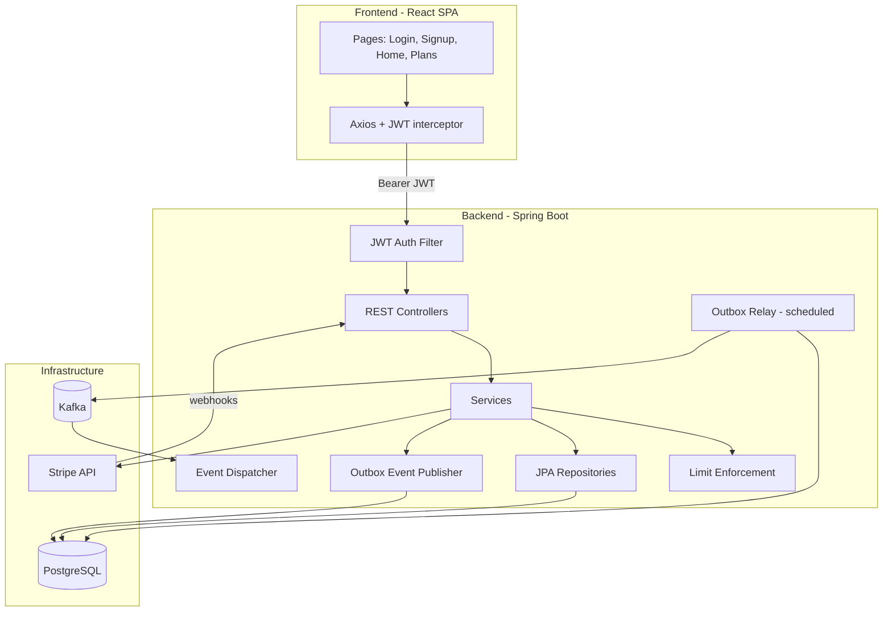
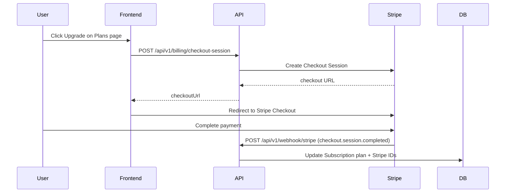

# TaskFlow

TaskFlow is a full-stack personal project for managing projects and tasks with tiered subscription limits. Users sign up on a free plan, organize work into projects, track tasks with status and priority, and can upgrade to Pro via Stripe checkout.

The backend (`com.tracknote`) is a Spring Boot API with JWT authentication, plan-based limit enforcement, and an event-driven subscription pipeline built on the **transactional outbox** pattern and **Apache Kafka**. The frontend is a React SPA that talks to the API over REST.

---

## Features

- **Authentication** — Register, login, JWT-based stateless sessions
- **Projects & tasks** — Create, read, update, and delete projects and nested tasks
- **Subscription tiers** — Free and Pro plans with configurable project/task limits
- **Stripe billing** — Checkout sessions and webhook-driven plan upgrades
- **Domain events** — Subscription lifecycle events persisted to an outbox and relayed to Kafka
- **Limit enforcement** — Server-side checks before creating projects or tasks

---

## Tech Stack

| Layer | Technologies |
|-------|--------------|
| **Frontend** | React 19, Vite, React Router, Axios, TanStack Query, Tailwind CSS |
| **Backend** | Java 17, Spring Boot 3.4, Spring Security, Spring Data JPA, Spring Kafka |
| **Database** | PostgreSQL 16 |
| **Messaging** | Apache Kafka (KRaft mode via Docker) |
| **Payments** | Stripe (Checkout + webhooks) |
| **API docs** | SpringDoc OpenAPI |

---

## Architecture

### High-level overview



### Backend layering

```
Frontend (React)
    ↓  REST / JSON
Controllers     → HTTP mapping, validation, auth principal
Services        → Business logic, transactions, Stripe, limits
Repositories    → JPA data access
Models / DTOs   → Entities and API contracts
Events / Outbox → Domain events → Kafka
```

| Package | Responsibility |
|---------|----------------|
| `controller` | REST endpoints for auth, projects, tasks, plans, billing, webhooks |
| `service` | Core business logic, subscription handling, DTO mapping, limits |
| `dao` | Spring Data JPA repositories |
| `model` | JPA entities (`User`, `Project`, `Task`, `Plan`, `Subscription`, `OutboxEvent`) |
| `events` | Domain events, Kafka topics, outbox publisher, consumer handlers |
| `outbox` | Scheduled relay that publishes pending outbox rows to Kafka |
| `config` | Security, CORS, Stripe, Kafka error handling |
| `JwtAuthFilter` | Validates JWT on protected routes |

### Frontend structure

```
Frontend/src/
├── api/           Axios instance with JWT request/response interceptors
├── context/       AuthProvider (sessionStorage token)
├── pages/         Login, Register, Home, Plans
├── components/    Modals for create/edit/delete (projects & tasks)
└── services/      API calls (auth, projects, tasks, plans, checkout)
```

---

## How It Works

### 1. Authentication

1. User registers via `POST /api/v1/auth/register`.
2. Backend creates a `User`, assigns a **FREE** `Subscription`, and publishes a `SUBSCRIPTION_CREATED` domain event to the **outbox** in the same transaction.
3. User logs in via `POST /api/v1/auth/login` and receives a JWT.
4. Frontend stores the token in `sessionStorage` and attaches it as `Authorization: Bearer <token>` on subsequent requests.
5. `JwtAuthFilter` validates the token and sets the security context for protected endpoints.

Public routes (no JWT required): `/api/v1/auth/**`, `/plans`, `/api/v1/webhook/stripe`, `/actuator/health`.

### 2. Projects and tasks

- Authenticated users manage projects at `/api/v1/projects`.
- Tasks are nested under projects at `/api/v1/projects/{projectId}/tasks`.
- The **Home** page loads all projects, then fetches tasks per project in parallel.
- Create/edit/delete flows use modal components; state is updated optimistically in React after successful API calls.

### 3. Plan limits

`LimitEnforcement` runs before creating a project or task:

| Plan | Typical limits |
|------|----------------|
| **FREE** | Capped projects and tasks per project (configured in `plans` table) |
| **PRO** | Higher or unlimited limits (`null` max = no cap) |

If a limit is exceeded, the API returns a `LimitExceededException` with a descriptive message.

### 4. Subscription upgrade (Stripe)



1. Logged-in user selects Pro on the **Plans** page.
2. Frontend calls `POST /api/v1/billing/checkout-session` with the Stripe price ID.
3. Backend creates or reuses a Stripe Customer, opens a Checkout Session, and returns the URL.
4. After payment, Stripe sends `checkout.session.completed` to the webhook endpoint.
5. `SubscriptionService` resolves the user and plan from session metadata, updates the `Subscription` row, and records the event for idempotency in `stripe_events`.

### 5. Transactional outbox and Kafka

Registration (and future subscription changes) do not publish to Kafka directly inside the request thread. Instead:

1. **Publish** — `OutboxDomainEventPublisher` serializes the domain event and inserts a row into `outbox_events` within the same DB transaction as the business write.
2. **Relay** — `outboxRelay` runs on a fixed schedule (`outbox.relay.fixed-delay-ms`, default 5s), locks a batch of unpublished events, and sends them to Kafka topics mapped in `KafkaTopics`.
3. **Consume** — `EventDispatcher` listens on subscription topics and routes messages to typed `EventHandler` beans by `eventType` header (e.g. `SubscriptionCreatedHandler`, `SubscriptionUpgradedHandler`).
4. **Resilience** — Failed publishes retry with exponential backoff; after max retries, events move to a dead-letter topic (`.dlt`).

This keeps the API response fast and consistent even if Kafka is temporarily unavailable.

---

## API Overview

| Method | Endpoint | Auth | Description |
|--------|----------|------|-------------|
| `POST` | `/api/v1/auth/register` | No | Create account + free subscription |
| `POST` | `/api/v1/auth/login` | No | Login, returns JWT |
| `GET` | `/plans` | No | List available plans |
| `GET` | `/api/v1/projects` | Yes | List user's projects |
| `POST` | `/api/v1/projects` | Yes | Create project |
| `PATCH` | `/api/v1/projects/{id}` | Yes | Update project |
| `DELETE` | `/api/v1/projects/{id}` | Yes | Delete project |
| `GET` | `/api/v1/projects/{id}/tasks` | Yes | List tasks in project |
| `POST` | `/api/v1/projects/{id}/tasks` | Yes | Create task |
| `PATCH` | `/api/v1/tasks/{id}` | Yes | Update task |
| `DELETE` | `/api/v1/tasks/{id}` | Yes | Delete task |
| `POST` | `/api/v1/billing/checkout-session` | Yes | Start Stripe checkout |
| `POST` | `/api/v1/webhook/stripe` | No* | Stripe webhook (*signature verified) |

Interactive API docs (when the backend is running): [http://localhost:8081/swagger-ui.html](http://localhost:8081/swagger-ui.html)

---

## Getting Started

### Prerequisites

- Java 17+
- Node.js 18+
- Docker & Docker Compose
- Stripe account (for billing flows)

### 1. Start infrastructure

From the project root:

```bash
docker compose up -d
```

This starts:

- **PostgreSQL** on `localhost:5433` (database: `gateflow`)
- **Kafka** on `localhost:9092`
- **Stripe CLI** forwarding webhooks to `http://host.docker.internal:8081/api/v1/webhook/stripe`

### 2. Configure environment

Create a `.env` file in the project root (used by Docker Compose) and ensure the backend has matching values. Required variables:

```env
POSTGRES_DB=gateflow
POSTGRES_USER=your_user
POSTGRES_PASSWORD=your_password
JWT_SECRET=your_jwt_secret
STRIPE_API_KEY=sk_test_...
STRIPE_WEBHOOK_SECRET=whsec_...
```

Backend `application.properties` reads `POSTGRES_USER`, `POSTGRES_PASSWORD`, `JWT_SECRET`, `STRIPE_API_KEY`, and `STRIPE_WEBHOOK_SECRET` from the environment. The database URL points to `jdbc:postgresql://localhost:5433/gateflow`.

### 3. Run the backend

```bash
cd Backend
./mvnw spring-boot:run
```

API base URL: `http://localhost:8081`

### 4. Run the frontend

```bash
cd Frontend
npm install
npm run dev
```

App URL: `http://localhost:5173`

---

## Project Layout

```
TaskFlow/
├── Backend/                 Spring Boot API (com.tracknote)
│   └── src/main/java/com/tracknote/
│       ├── controller/      REST layer
│       ├── service/         Business logic
│       ├── dao/             Repositories
│       ├── model/           JPA entities
│       ├── events/          Domain events + Kafka consumers
│       └── outbox/          Outbox relay
├── Frontend/                React SPA
│   └── src/
│       ├── pages/           Route-level views
│       ├── components/      Shared UI (modals, protected route)
│       ├── services/        API clients
│       └── context/         Auth state
└── docker-compose.yml       Postgres, Kafka, Stripe CLI
```

---

## Design Decisions

- **Stateless JWT auth** — No server-side sessions; fits a SPA and horizontal scaling.
- **Transactional outbox** — Domain events are never lost if Kafka is down; relay catches up when it recovers.
- **Idempotent Stripe webhooks** — Processed event IDs stored in `stripe_events` to prevent duplicate upgrades.
- **Server-side limits** — Plan caps enforced in the service layer, not only in the UI.
- **Monorepo** — Frontend and backend live together for a cohesive personal portfolio project.

---

## Testing

Backend unit tests cover services, DTO mapping, outbox publishing, and event message contracts:

```bash
cd Backend
./mvnw test
```

---

## License

Personal portfolio project — not licensed for commercial use unless otherwise noted.
